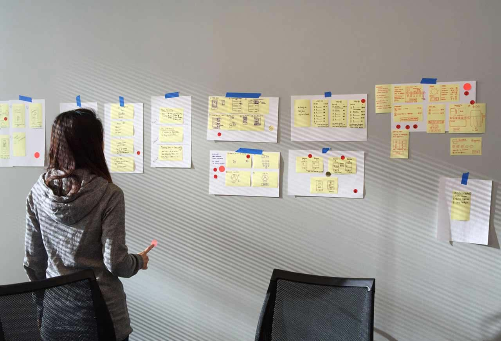
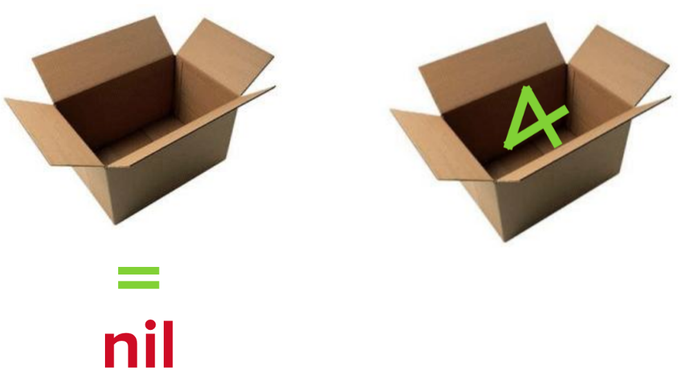
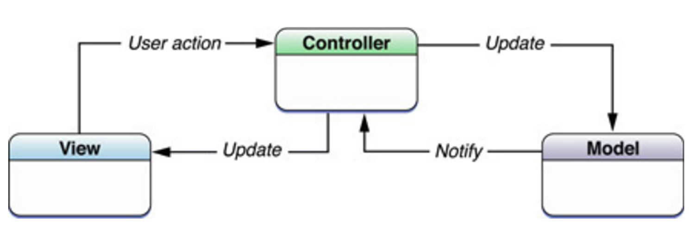

# [fit] Getting Started	  
# [fit] With _**iOS**_

---

# __*Bori Oludemi*__
### iOS Developer & "General Technologist"

---

#### Born and bred in Nigeria
#### Love the real football

---

# __*Austin Lamon*__
### iOS Framework Engineer

---

## I write code, it lives here

---

## Coding the Client

### __*"Coding for the Customer"*__
### __*...*__
### __*User Experience*__
### __*User Interaction*__

---

---

## Coding the Core

## _**APIs**_
## _**Reusability**_
## _**Security**_
## _**Scalability**_

---

# **But, how do** _**I**_ **get started?**

---

# _**1. Overcome Barriers to Entry**_
- Swift, Xcode, iOS frameworks

# _**2. Build Anything!**_
- Online Tutorial
- Deconstruct an app

---

## Let's start with an overview of _**Swift**_

---

## [fit] _**Optionals**_

---

## Design Patterns
## &
## App Structure

---

## [fit] _**MVC**_
- _Model:_ encapsulate the data specific to an app
- _ViewControllers:_ contain the “glue” code between views and models
- _Views:_ are parts of the app that users can see

---

---

## [fit] _**Storyboards**_
- Visually lay out your app’s scenes and the user’s path
- Scene == View == Screen
	- Has subviews (buttons, labels, text, etc)
- Typically tied to an instance of a _UIViewController_

---

## [fit] __*Digging Deeper*__

---

### Plan
- Xcode New Project :flushed:
- Basic App Structure
- Animations... because :information_desk_person:
- Environment Setup / Deconstruct

---

### github.com/austinlamon/summit-sw-engineers-may17

---

---

# [fit] Next Steps?
- Backend integration
- watchOS?, tvOS?
- _**Keep Learning -- Build Anything**_

---

___

# [fit] _**Resources**_
- Ray Wenderlich Tutorials (raywenderlich.com)
- Stanford iOS Class (http://itunes.stanford.edu/)
- developer.apple.com

---

# [fit] Questions?
## [fit] _**@austin\_lamon**_
## [fit] _**@borikanes**_

---

